# Battleship2D

A 2D PvP batteship game entirely made in cmd using SQL*Plus in a Distributed Database System!!!

### **Requirements**
* Oracle Database 10g
* VMware Workstation (optional)

### **How to Play**

Please check out the [procedure.txt](procedure.txt) file to learn how to play the game.

### **Demo**

Check out some screenshots of the gameplay!!!

* **New Player**
---
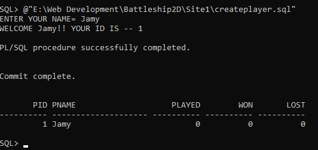
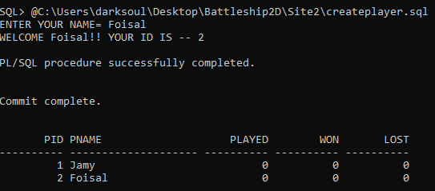

* **Board**
---
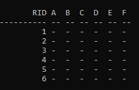

* **Ships Placed**
---
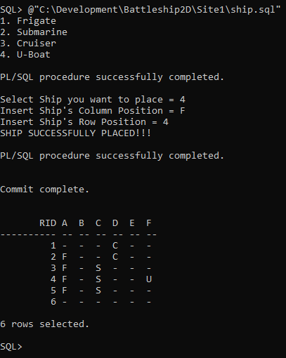

* **Missile Hit**
---
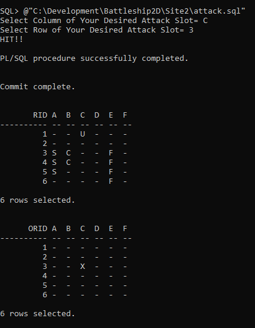

* **Missile Miss**
---
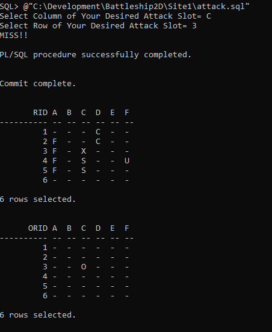

* **Ship Sunk**
---
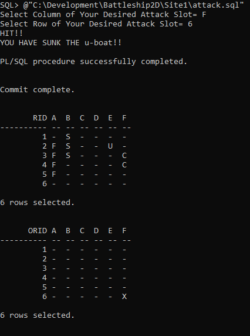

* **Game Over**
---
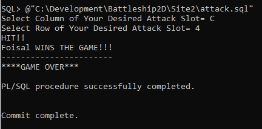

* **Score Board**
---
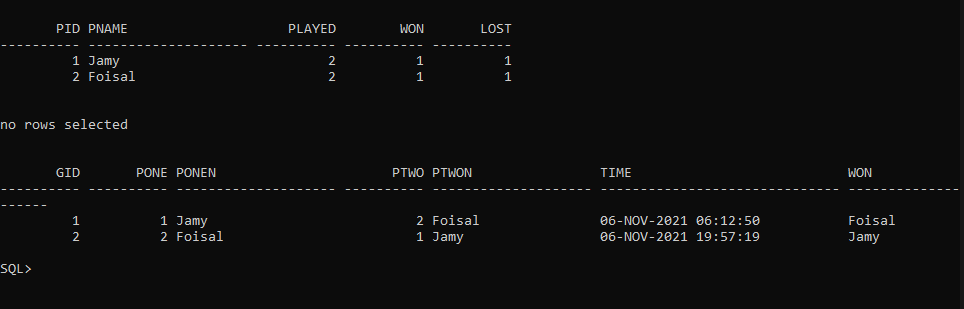

### **Error Handling**

Some errors handling examples shown here:

* **Ship Exceeds the Board**
---
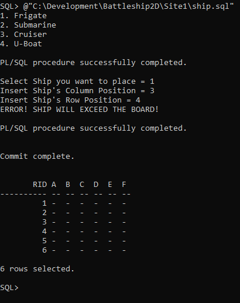

* **Ship Overlaps Another Ship**
---
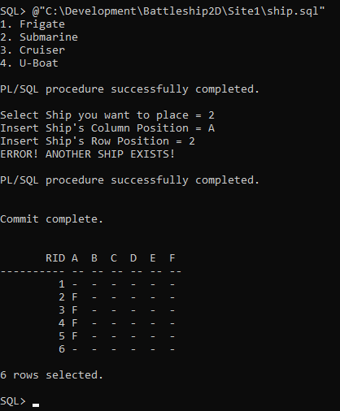

* **Ship Already Exists**
---
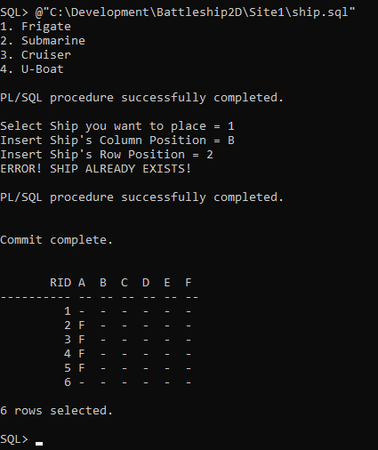

* **Missile Attack Overlap**
---
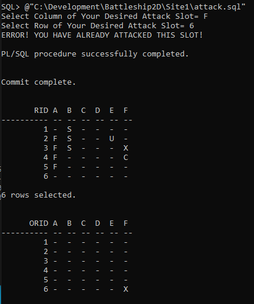

*and many more!!!
